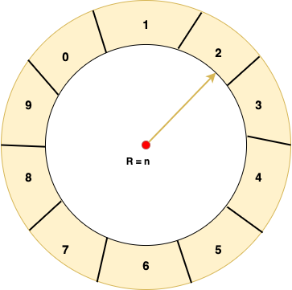
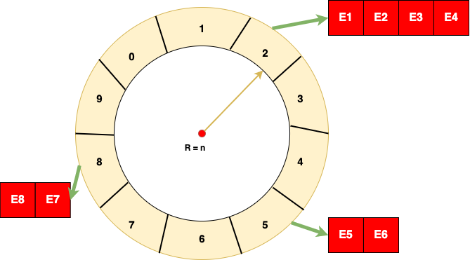

# Timer-Scheduler

It is very common scenario in System Programming, that the application need to perform some action periodically. Hence, there should be a mechanism to systematically fire up or trigger some processing periodically. Among different kinds of data structures, **Wheel Timer** is the one used for this purpose. It gives us the ability to schedule and fire up events periodically. One simple application of Wheel Timer is in control plane domain, where a network protocol needs to send update messages periodically to adjacent nodes.

Look at below picture. There are 10 slots in out Wheel timer. And each slot corresponds to 1 second. So, our Wheel timer resembles to a wall clock, which have 10 seconds in one round instead of 60 seconds.


Each slot has some linked list attached to it. This list is a list of events to be triggered when clock tick hits that particular slot. Every time the wheel timer complete one rotation, R is increased by 1.



When the pointer of the clock points to let's say slot number 2, All events which are formed in a linked list will be fired up.

There are mainly two design challenges:

1. When an event needs to be executed every let's say 3 seconds. In that case, each time the pointer reaches that event, it needs to re-schedule it in three seconds later from its current time slot.

2. When an event needs to be executed every let's say 30 seconds. In this case, the timer should pass three full rotation. In this situation, the value R will be considered.

Events are nothing but function pointers. Let's look at the below structure to see what's inside Wheel timer:
```
typedef struct _wheel_timer_t{
  int current_clock_tic; // current slot number which is pointed by the clock tick, it increases by 1 per second
  int clock_tic_interval; // time interval by which the clock tick moves, 1 second in our case
  int wheel_size; //1 total number of slots
  int current_cycle_no; //number of rotations the clock tick has completed, R value
  pthread_t wheel_thread; //thread of wheel timer
  ll_t *slots[0]; //linked list attached to the slots of wheel timer, array size is dynamically allocated to wheel_size value
}_wheel_timer_t;
```
Below routine is to initialize the wheel timer and returns the wheel timer object:
```
wheel_timer_t*
init_wheel_timer(int wheel_size, int clock_tic_interval){ //inputs to the wheel timer are its size, and clock tick interval
  wheel_timer_t *wt = calloc(1, sizeof(wheel_timer_t) + //get the memory for wheel timer, note that wheel_size number of wheel_size*sizeof(ll_t*)));                      slots are dynamically allotted. Each slot carries pointed to linked list

  wt->clock_tic_interval = clock_tic_interval;
  wt->wheel_size = wheel_size;
  wt->current_cycle_no = 0;
  memset(&(wt->wheel_thread), 0, sizeof(wheel_timer_t));
  int i = 0;
  for(; i< wheel_size; i++)
    wt->slots[i] = init_singly_ll();

  return wt;
}
```

When wheel timer object is obtained from above routine, our next task is to run the wheel timer in an infinite loop in a separate thread. To start the wheel timer use below API:
```
void
start_wheel_timer(wheel_timer_t *wt){ //pass the cooked up wheel timer object pointer
  pthread_t *thread = &wt->wheel_thread;   // Get the wheel timer thread which we have to run next
  if(pthread_create(thread, thread->attr(NULL), wheel_fn, (void*)wt)){
    printf("Wheel timer thread initialization failed, exiting ...\n");
    exit(0);
  }
}
```
The above created thread will execute ```wheel_fn``` function with input argument of ```(void*)wt```. After the call, the execution of ```wheel_fn``` is invoked in a separate thread. pseudo code of ```wheen_fn``` is like below:
```
void *wheel_fn(void *arg){
  wheel_timer_t *wt = (wheel_timer_t*)arg;
  while(1){
    sleep(wt->clock_tic_interval);
    slot_list = wt->slots[wt->current_clock_tic]; //get the list of events in this slot

    Traverse over slot list, and fire up events which match the firing criteria as discussed before. Re-position the events if they need to be fired again periodically. this included calculate the new slot of the events.

    wt->current_clock_tic++;
    if(wt->current_clock_tic == wt->wheel_size){
      wt->current_clock_tic = 0;
      wt->current_cycle_no++;
    }
  }
}
```
Another important thing to consider is the structure representation of Events which are stored in linked lists of slots. Events are called as ```wheel_timer_elem_t```.
```
struct _wheel_timer_elem_t{
  int time_interval; //time interval after which this events needs to be triggered next
  int execute_cycle_no; //after how many rotations this events needs to be triggered (r value)
  app_call_back app_callback; //The application function this events needs to execute
  void *arg; //argument to the application function
  int arg_size; //arg_size
  char is_recurrence;  // if 1, then this event needs to trigger after every time_interval sec, else, only one
};
```
As you can see above, one of the argument in the structure is function pointer. ```app_call_back``` is a function pointer data type as defined below. Application should register the function of below prototype with wheel timer.
```
typedef void* (*app_call_back)(void 8arg, int size_of_arg);
```
Final thing to do is to write an API to register an event with wheel timer using ```register_app_event()```.
```
wheel_timer_elem_t*
register_app_event(wheel_timer_t *wt,   // wheel timer pointer with which we are registering an event
  app_call_back call_back,              // application function pointer which will be invoked by wheel timer
  void *arg,                            // argument to above routine
  int arg_size,                         // size of arg
  int time_interval,                    // time interval after which call_back routine is to be invoked
  char is_recursive){                   // 1 for periodically, 0 for once

    wheel_timer_elem_t *wt_elem = calloc(1, sizeof(wheel_timer_elem_t)); //create a wheel timer element data structure to store the event

    wt_elem->time_interval = time_interval;
    wt_elem->app_callback = call_back;
    wt_elem->arg = calloc(1, arg_size);
    memcpy(wt_elem->arg, arg, arg_size);
    wt_elem->arg_size = arg_size;
    wt_elem->is_recurrence = is_recursive;

    find the slot where the wt_elem needs to be placed. Insert the wt_elem in the slot's linked list
    calculate r and slot number

    return wt_elem;
  }
```
